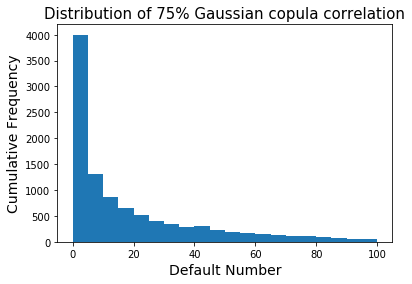
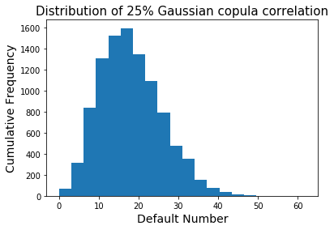

# How Copula Correlation Affect Default Numbers ?
 
### author: Yi Rong
### date: 03/21/21

---

### Problem
Given 100 names, hazard rate 20%, one year horizon, and 50% Gaussian copula correlation,
generate samples of default times (use 10,000 random samples) and plot the distribution of
defaults number. Repeat the process for 25% Gaussian copula correlation and for 75% Gaussian
copula correlation. Compare the results.

### Solution

The code to generate default numbers and plot is shown as below:

```{python }
# Gaussian copula generating default numbers
def GC(p, N, cor, hr):
    dnumber = [None] * p # default number list
    
    for i in range(p):
        Z = np.random.normal(0, 1, 1)
        eps = np.random.normal(0, 1, N)
        A = cor * Z + np.sqrt(1 - cor ** 2) * eps
        u = si.norm.cdf(A)
        tau = -1 / hr * np.log(1 - u)
        dnumber[i] = sum(num < 1 for num in tau)  
    
    return dnumber

df2 = GC(10 ** 4, 100, 0.50, 0.2)
```

```{python }
# Plot the distribution
plt.hist(df2, bins = 20)
plt.title('Distribution of 50% Gaussian copula correlation',fontsize=15)
plt.ylabel('Cumulative Frequency', fontsize=14)
plt.xlabel('Default Number', fontsize=14)
plt.show()
```
The distribution for 50% Gaussian copula correlation should be:


The distribution for 75% Gaussian copula correlation should be:



The distribution for 25% Gaussian copula correlation should be:



### Conclusion
We can find that the Gaussian copula correlation determines the skewness of the
distribution. When the correlation drops from 75% to 25%, the skewness tranforms from right to
left. This indicates the default number is negatively relative to the copula correlation.